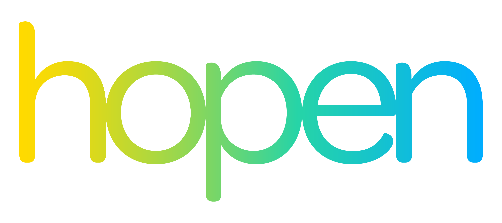
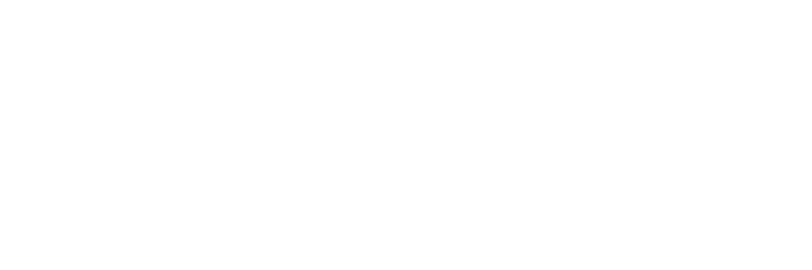
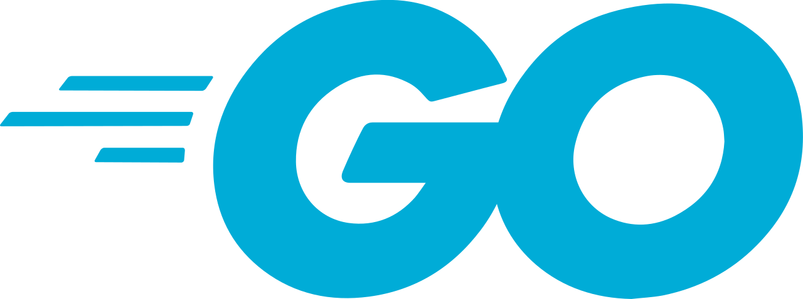

<h1 align="center">Tech founder / AI research </h1>

  AI research | Mobile frontend | Scalable backend | DevSecOps

  

I care about software that feels simple and clear on the surface, while being technically strong and resilient underneath.

I research frontier solutions to push the boundaries of LLM inference, spanning high-performance **cloud infrastructure (A100/H100)** and optimized **local/edge execution** (Apple Silicon).

**Hopen** is the product expression of that focus: a brand-new social platform bringing together Flutter, Go, and real-time systems to help everyone make true friends.

**sabr** represents the system-level frontier: an open standard for runtime portability, connecting KV caches, routing state, and observability across engines.

**Blackhole** adapts game-engine optimization pillars to the LLM world, dramatically accelerating high-performance inference through custom kernels and memory-aware scheduling.

## Working with

  
  
  
  
  
  
  
  

  
  
  
  
  
  

  
  
  
  
  
  
  
  
  
  
  

  
  
  

  
  
  
  
  
  
  

  
  
  
  

  
  

## Exploring

  
  
  
  
  
  
  
  
  

## Building

  

- Hopen: The social app to help everyone make true friends.
  - Building a Flutter client shaped by clean architecture, strong interaction design, and real-time UX.
  - Building a Go backend around gRPC, events, messaging, and operational clarity.
  - Building a DevSecOps pipeline that follows best practices.
- Discover Hopen at [hopenapp.com](https://hopenapp.com)

  

- [sabr](https://github.com/KevinHernot/sabr) is a high-performance, native-first inference stack for Apple Silicon, focused on portable KV caches, routing state, and observability. The aim of sabr is to move beyond vllm frontier.
  - **Dynamic Runtime**: Keeps orchestration and model loading in C++ to minimize overhead and allocator churn on unified-memory systems.
  - **Silicon-Native Backends**: Optimized MLX and Metal paths for stable-shape decode bucketing, GPU-resident attention, and persistent pipelines.
  - **Deterministic Placement**: Implements a unified heap for predictable token placement and replay, avoiding reactive paging under memory pressure.
  - **Logical Sparsity**: Integrated routing layer selects active token sets without forcing physical memory compaction on every step.
  - **Unified ABI**: Shared contract for byte-paged storage, graph-side transforms, and per-layer dense/packed execution policies.
  - **System Parity**: Shipped with vectorized dequantization and race-free kernels, ensuring consistent throughput across Apple environments.

  

- Blackhole: LLM inference hits the same enemy that 90s game engines fought — the **memory wall**. Doom, Quake, and Minecraft survived on a few megabytes of RAM by developing an entire science of *algorithmic illusion*: never render what the player can't see, never move data the GPU doesn't need, never store what you can generate on the fly. Blackhole translates five of those game-engine paradigms into the transformer attention mechanism:
  - **Semantic PVS**: Quake precomputed which rooms were visible from each position and skipped everything else. Blackhole does the same: a lightweight routing layer estimates which KV blocks matter and skips loading the rest. *Don't render what the player can't see; don't attend to what the query doesn't need.*
  - **Portal Attention**: Descent split worlds into rooms connected by portal polygons and only rendered what was visible through the current doorway. Blackhole partitions context into semantic domains, keeps only the active domain plus a small bridge window live, and gates out everything else. *Don't load the entire map when you're standing in one room.*
  - **Predictive Transport**: Quake III didn't send full player coordinates every frame — the client predicted locally and the server only sent a correction delta. Blackhole predicts the next activation state locally and transmits only the residual error between devices. *Don't send the whole packet when a small correction will do.*
  - **Procedural Weights**: No Man's Sky generates entire galaxies from tiny seeds, trading storage for compute. Blackhole identifies low-salience weight tiles and regenerates them on the fly from compact seeds, bypassing the memory bus entirely. *Don't store what you can cheaply recompute.*
  - **Token Merging**: Voxel engine mods merge adjacent identical block faces into single large rectangles to cut draw calls. Blackhole fuses adjacent tokens with near-identical KV representations, shrinking the sequence dimension itself. *Don't process a hundred redundant faces when one rectangle will do.*
 - [blackhole](https://github.com/KevinHernot/blackhole) is the Python proof-of-concept and algorithm reference layer for the five pillars.
 - [blackhole_runtime](https://github.com/KevinHernot/blackhole_runtime) is the executable runtime and backend workspace carrying the C++/ggml/Metal/CUDA/vllm/MLX path toward parity with the Python PoC.

- [mlxsidecar](https://github.com/KevinHernot/mlxsidecar) is an open-source Python sidecar for local and edge AI inference:
  - It exposes a small generic contract for `generate`, `embed`, `score`, and `classify` workloads instead of locking into a single model shape.
  - It runs inference behind an explicit queue with microbatching so HTTP stays responsive while model work is coalesced efficiently.
  - It ships with a dependency-free `echo` engine for tests and demos plus an optional MLX-backed engine for Apple Silicon text generation.
  - It reflects the local inference building blocks behind the Apple-native runtime work, extracted into a reusable service primitive.

  

- [relaybox](https://github.com/KevinHernot/relaybox) is an open-source Go project for reliable event delivery primitives:
  - It provides idempotent NATS consumers with stable event identity extraction from headers, payload IDs, and canonical JSON hashes.
  - It now includes transactional outbox primitives: portable repository interfaces, an in-memory repository, batch processing, retry/backoff handling, and a Core NATS publisher.
  - It also includes delayed message scheduling by reusing the outbox lifecycle through `AvailableAt`, keeping delayed delivery and normal publish retries on the same path.
  - It packages common backend event-delivery patterns into a smaller public building block instead of another monolithic framework.

- [fencelock](https://github.com/KevinHernot/fencelock) is an open-source Go project for distributed locks with fencing tokens:
  - It exposes a small `Manager` / `Lock` API where every successful acquisition receives a monotonically increasing token.
  - It ships with a backend-neutral `Store` interface, a process-local `MemoryStore`, and a Valkey-backed implementation using `INCR`, `SET NX EX`, and Lua compare-and-delete / compare-and-refresh scripts.
  - It includes a `MemoryFencingTokenGuard` to demonstrate the critical resource-side rule: reject any write whose token is not newer than the highest token already accepted.
  - It centers the concurrency-control rule that a TTL lock alone is not enough if a paused worker can wake up after its lease has expired.

- [go_guardrails](https://github.com/KevinHernot/go_guardrails) is an open-source Go static-analysis tool for production services:
  - It ships a `goguardrails` CLI that flags missing context propagation, leaked cancel ownership, unmanaged goroutines, and implicit `http.Response.Body.Close()` error handling.
  - It focuses on failure modes that are easy to miss in review and annoying to debug after deployment.
  - It reflects reliability checks from service-heavy Go systems, extracted into a small developer-facing guardrail instead of buried tribal knowledge.

- [sagabox](https://github.com/KevinHernot/sagabox) is an open-source Go project for small saga orchestration primitives:
  - It includes explicit state transitions, resumable steps, reverse-order compensation, recovery strategies, and repository-backed workflow state.
  - It stays storage-agnostic so applications can plug in PostgreSQL, SQLite, Valkey, files, or any other persistence layer.
  - It reflects distributed workflow and recovery patterns from backend systems work, extracted into a neutral building block instead of another opinionated framework.

  

- [hardware_backed_dpop](https://github.com/KevinHernot/hardware_backed_dpop) is an open-source Flutter plugin for hardware-backed DPoP binding and proof signing:
  - It generates ES256 key material inside Android Keystore and iOS Secure Enclave / Keychain paths so the private key never needs to leave native storage.
  - It exposes the public binding material a backend needs (`rawPublicKey`, `jkt`, `jwk`) and signs JWS inputs natively for DPoP proofs.
  - It packages mobile-side proof-of-possession primitives into a focused auth building block.

- [dialog_harbor](https://github.com/KevinHernot/dialog_harbor) is an open-source Flutter package for reliable dialog-intent delivery:
  - It is designed for apps where important dialog events can arrive before the UI is ready, during reconnects, or across tricky lifecycle transitions.
  - The package centers on buffered delivery, TTL and priority-aware eviction, and persistence hooks for critical dialog intents.
  - It packages buffered delivery, TTL and priority-aware eviction, and persistence hooks into a reusable Flutter primitive.

- [safe_back_navigation_wrapper](https://github.com/KevinHernot/safe_back_navigation_wrapper) is an open-source Flutter package for safer back-button handling:
  - It wraps Flutter's modern `PopScope` API in a small, router-agnostic primitive that helps prevent accidental app exits on root screens.
  - The package supports fallback navigation callbacks and a reusable mixin for pages that want explicit back-navigation control without coupling to `go_router`, `auto_router` or anything else.
  - It packages a small but practical UX/navigation pattern into a reusable package.
