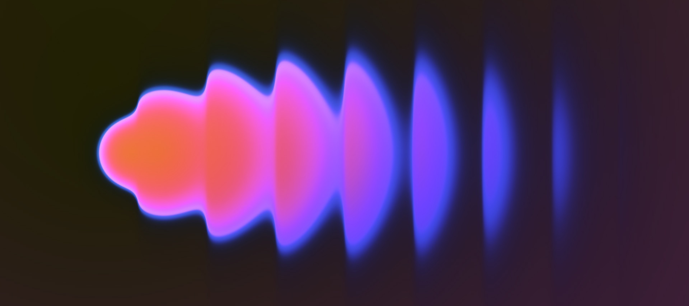

<h1 align="center">Tech founder / AI research scientist</h1>

  AI research | Mobile frontend | Scalable backend | DevSecOps

  

I care about software that feels simple and clear on the surface, while being technically strong and resilient underneath.

I research frontier solutions to push the boundaries of LLM inference, spanning high-performance **cloud infrastructure (A100/H100)** and optimized **local/edge execution** (Apple Silicon).

**Hopen** is the product expression of that focus: a brand-new social platform bringing together Flutter, Go, and real-time systems to help everyone make true friends.

**Open Runtime Interchange (ORI)** represents the system-level frontier: an open standard for runtime portability, connecting KV caches, routing state, and observability across engines.

**Blackhole** adapts game-engine optimization pillars to the LLM world, dramatically accelerating high-performance inference through custom kernels and memory-aware scheduling.

## I ❤️

  
  
  
  
  
  
  
  

  
  
  
  
  

  
  
  
  
  
  
  
  
  
  
  

  
  
  
  
  

  
  
  
  
  
  

  
  
  

  
  

## I 👍

  
  
  
  
  
  
  
  

## I 🚧

  

- Hopen: The social app to help everyone make true friends.
  - Building a Flutter client shaped by clean architecture, strong interaction design, and real-time UX.
  - Building a Go backend around gRPC, events, messaging, and operational clarity.
  - Building a DevSecOps pipeline that follows best practices.
  - Discover Hopen at [hopenapp.com](https://hopenapp.com)

  

- ORI: [Open Runtime Interchange](https://github.com/KevinHernot/Open_Inference_Fabric_%28OIF%29) is an open runtime standard for LLM inference focused on portable KV caches, routing state, observability, disaggregated serving, conformance, and a native runtime track instead of another closed engine silo.
  - This project is intentionally standards-first. ORI is not "yet another inference engine," a Kubernetes platform, or a scheduler product. It is a portable runtime and data-plane contract that inference engines, routing runtimes, and serving platforms can adopt together.
  - The working thesis is simple:
    > OpenAI compatibility is necessary, but it is not enough.
  - OpenAI-style APIs made client integration easier, but runtimes still diverge in the most important places underneath the surface:
    - cache identity and reuse
    - disaggregated prefill/decode handoff
     - routing state for MoE, RAG, and tools
    - backend-specific capabilities
    - observability, replay, and benchmark output
  - ORI focuses on those lower layers without mandating one kernel stack, one router or one serving topology.

  

- Blackhole: Five game-engine optimization pillars adapted from 90s rendering tricks to improve and accelerate LLM.
  - [blackhole](https://github.com/KevinHernot/blackhole) is the Python proof-of-concept and algorithm reference layer for Blackhole's five pillars.
  - [blackhole_runtime](https://github.com/KevinHernot/blackhole_runtime) is the executable runtime and backend workspace carrying the C++/ggml/Metal/CUDA/MLX path toward parity with the Python PoC.
