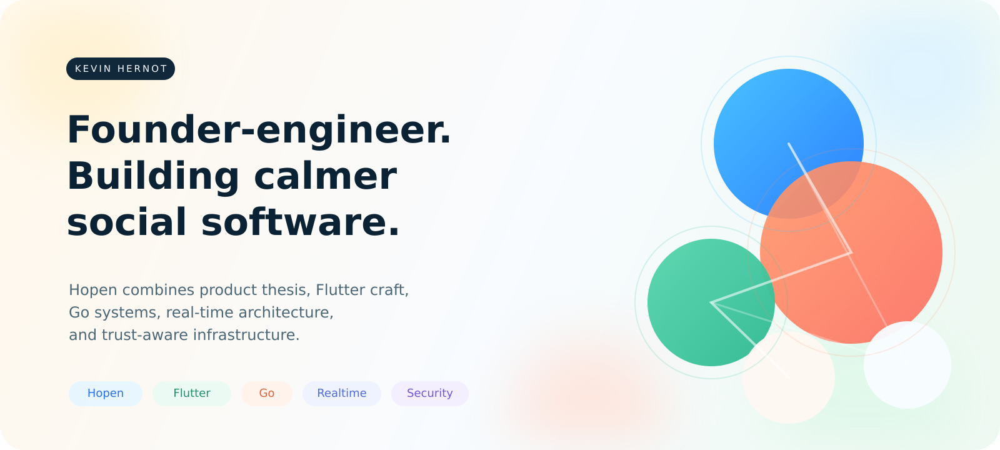

  

  <strong>Kevin Hernot</strong> 
  Founder-engineer building Hopen, a contextual social app designed to help people make true friends.

  Smaller circles | Real conversations | Stronger trust

  AI research | Mobile frontend | Scalable backend | DevSecOps

I care about software that feels emotionally clear on the surface and technically serious underneath.

Hopen is the clearest expression of that. It brings together product narrative, Flutter interface work, Go microservices, real-time transport, voice and video, authentication, authorization, observability, and platform architecture in one coherent system.

## I love

  
  
  
  
  
  
  
  

  
  
  
  
  
  
  
  

  
  
  
  
  
  
  
  
  
  
  

  
  
  
  

## I like

  
  
  
  

## Building now

- Hopen: The social app to help everyone make true friends.
  - Building a Flutter client shaped by clean architecture, strong interaction design, and real-time UX.
  - Building a Go backend around gRPC, events, messaging, and operational clarity.
  - Building a DevSecOps pipeline that follows best practices.
  - Discover Hopen at [hopenapp.com](https://hopenapp.com)
- Aliaser: Semantic Frame Graph Planning for Heterogeneous Memory Reuse in Agentic LLM Workflows
  - Built a Python proof-of-concept for Semantic Frame Graph Planning for Heterogeneous Memory Reuse in Agentic LLM Workflows.
  - Building the implementation of Aliaser, currently awaiting A100/H100 runtime benchmarks.
  - Writing the article.
